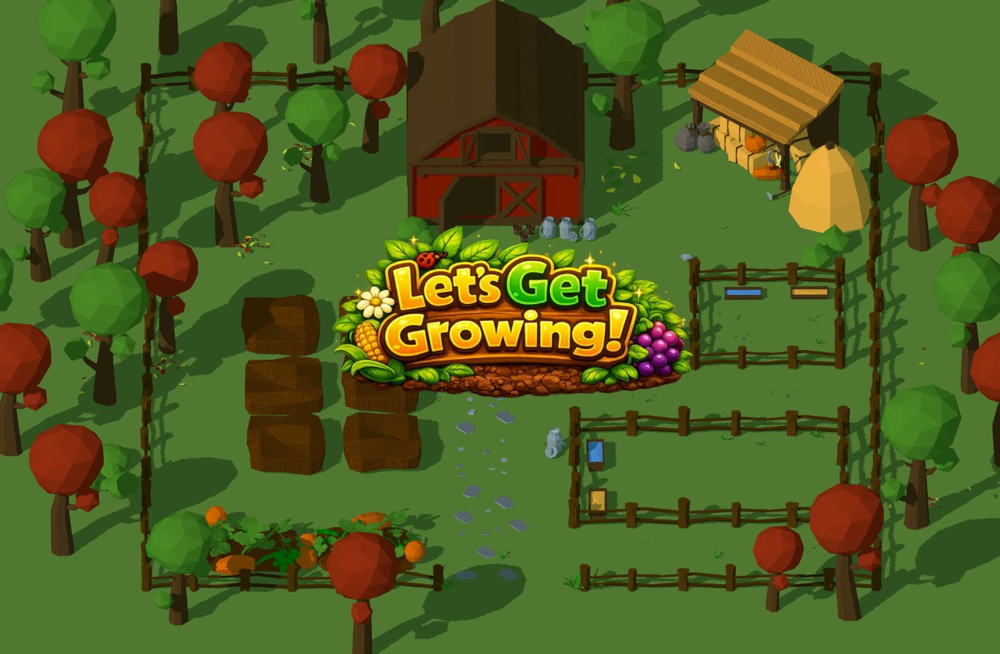

# Garden Makeover

An interactive 3D garden decoration experience built for the web.



## Live Demo

[Play Garden Makeover](https://69c15b5c484e1e3260503677--charming-cassata-abd02b.netlify.app/)

## About

A polished, production-ready interactive 3D web game built for a client. Players explore a garden scene and click on interactive spots to add animals, plants, and furniture — bringing the garden to life with animations, sound effects, and particle effects.

The entire experience runs in the browser with no plugins or installs required.

## Key Highlights

**Single-file build** — The entire game (3D models, audio, images, code) bundles into a single HTML file with all assets embedded as data URIs. Powered by Vite with custom plugins for PNG-to-WebP conversion and single-file output.

**3D + 2D hybrid rendering** — Three.js handles the 3D garden scene while Pixi.js renders the 2D UI as an overlay. Two rendering engines work together seamlessly in a layered architecture.

## Features

- Interactive 3D garden scene rendered with Three.js
- 2D UI overlay system built with Pixi.js
- Three decoration categories:
  - **Animals** — Cow, Sheep, Chicken (with skeletal animations and idle loops)
  - **Furniture** — Table, Cart, Swing
  - **Plants** — Tomato, Strawberry, Grape, Corn
- Smooth animations and transitions powered by GSAP
- Audio system with background music and contextual sound effects via Howler.js
- Sprite-sheet particle effects (smoke, flourishes)
- Animated intro and outro sequences with camera movement
- Responsive layout

## Tech Stack

| Technology | Role |
|---|---|
| [Three.js](https://threejs.org/) | 3D rendering and scene management |
| [Pixi.js](https://pixijs.com/) | 2D UI overlay and sprite effects |
| [GSAP](https://gsap.com/) | Animation and tweening |
| [Howler.js](https://howlerjs.com/) | Audio playback |
| [Vite](https://vite.dev/) | Build tool and dev server |
| [Sharp](https://sharp.pixelplumbing.com/) | Image optimization (PNG → WebP) |
| [glTF-Transform](https://gltf-transform.dev/) | 3D model optimization |

## Project Structure

```
src/
├── assets/
│   ├── audio/          # MP3 sound effects and music
│   ├── effects/        # Sprite sheet particle effects
│   ├── images/         # UI elements, icons, backgrounds
│   └── models/         # GLB 3D models (animals, furniture, plants, level)
├── components/
│   ├── spots/          # Interactive spot classes (AnimalPen, Plant, Furniture)
│   ├── UI.js           # UI layout and management
│   ├── HelperCursor.js # Custom cursor
│   └── StarburstEffect.js
├── core/
│   ├── Game.js         # Main game loop and logic
│   ├── SceneSetup.js   # Three.js scene initialization
│   ├── PixiSetup.js    # Pixi.js overlay setup
│   ├── AssetLoader.js  # Asset loading system
│   └── Audio.js        # Audio management
├── main.js             # Entry point
├── constants.js        # Game configuration and spot definitions
└── utils.js            # Utility functions
```

## Getting Started

### Prerequisites

- [Node.js](https://nodejs.org/) (v18+)

### Install & Run

```bash
# Install dependencies
npm install

# Start development server
npm run dev

# Build for production (outputs a single HTML file to /dist)
npm run build

# Preview the production build
npm run preview
```

## Asset Pipeline

The build process includes several optimization steps:

- **Images**: PNGs are converted to WebP at build time via a custom Vite plugin using Sharp
- **3D Models**: GLB files are optimized with glTF-Transform (compression, dedup, texture optimization)
- **Bundling**: `vite-plugin-singlefile` inlines all assets as data URIs into a single `index.html`

```bash
# Run asset optimization manually
npm run optimize

# Preview what would be cleaned up
npm run clean-assets:dry-run
```

## Author

[@mivebe](https://github.com/mivebe)
